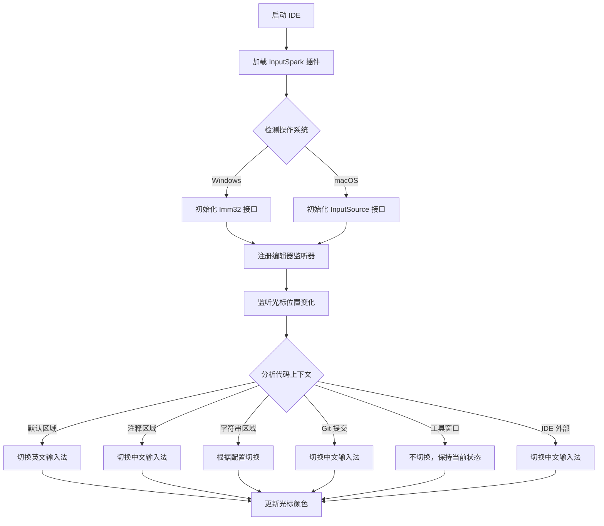

## 1. 产品概述
InputSpark（输入火花）是一款免费开源的IntelliJ IDEA智能输入法切换插件，旨在帮助中文母语开发者提升编码效率。通过智能识别代码上下文环境，自动切换中英文输入法，减少因输入法切换导致的输入错误，让编码过程更加流畅高效。

**当前版本**: v1.3.0

目标用户：中文母语的程序员开发者，解决编码过程中频繁切换输入法的痛点，提供比Smart Input Pro更轻量、免费、开源的替代方案。

## 2. 核心功能

### 2.1 用户角色
| 角色 | 使用方式 | 核心权限 |
|------|----------|----------|
| 普通用户 | 插件市场下载安装 | 使用所有基础功能，自定义配置 |
| 高级用户 | 源码编译安装 | 深度定制，贡献代码 |

### 2.2 功能模块
InputSpark 插件包含以下核心功能模块：
1. **设置面板**：输入法切换规则配置，光标颜色设置，场景开关控制
2. **状态指示器**：IDE 状态栏显示当前输入法状态（可选）
3. **规则编辑器**：自定义输入法切换规则配置界面
4. **应用生命周期监听**：离开/返回 IDE 时自动切换输入法
5. **焦点追踪器**：识别"在 IDE 内但不在编辑器"场景

### 2.3 页面详情
| 页面名称 | 模块名称 | 功能描述 |
|----------|----------|----------|
| 设置面板 | 场景配置 | 启用/禁用各个自动切换场景（默认、注释、字符串、Git 提交） |
| 设置面板 | 光标设置 | 配置不同输入法状态对应的光标颜色 |
| 设置面板 | 系统设置 | Windows/macOS 系统输入法切换参数配置 |
| 状态指示器 | 状态显示 | 在 IDE 状态栏实时显示当前输入法状态（可选） |
| 规则编辑器 | 规则列表 | 显示所有自定义规则，支持启用/禁用、编辑、删除 |
| 规则编辑器 | 规则创建 | 添加新的正则表达式规则，指定触发条件和目标输入法 |

## 3. 核心流程

### 用户操作流程
1. 用户安装插件后首次启动，插件自动检测操作系统类型
2. 根据系统类型初始化对应的输入法切换接口（Windows Imm32/macOS InputSource）
3. 用户可在设置面板中配置各场景的切换规则和光标颜色
4. 插件实时监控光标位置和代码上下文，自动切换输入法
5. 通过光标颜色变化提供视觉反馈

## 4. 用户界面设计

### 4.1 设计风格
- **整体风格**：简洁现代，符合 IntelliJ IDEA 原生 UI 风格
- **颜色方案**：
  - 主色调：IntelliJ 默认主题色（#3875D7）
  - 光标颜色：
    - 英文输入法：绿色（#4CAF50）
    - 中文输入法：红色（#F44336）
    - 日文输入法：蓝色（#2196F3）
- **字体**：使用 IDE 默认字体，保持一致性
- **布局**：卡片式布局，分组清晰，操作简单直观

### 4.2 页面设计概述
| 页面名称 | 模块名称 | UI 元素 |
|----------|----------|----------|
| 设置面板 | 场景配置 | 使用复选框列表，每个场景配有说明文字和启用开关 |
| 设置面板 | 光标设置 | 颜色选择器，实时预览效果，提供恢复默认按钮 |
| 设置面板 | 系统设置 | 下拉选择系统输入法，测试连接按钮 |
| 状态指示器 | 状态显示 | 状态栏图标，悬停显示详细信息（可选） |
| 规则编辑器 | 规则列表 | 表格形式显示规则，包含规则名称、正则表达式、目标输入法 |
| 规则编辑器 | 规则创建 | 对话框形式，输入规则名称、正则表达式，选择目标输入法 |

### 4.3 响应式设计
- 桌面优先设计，专门针对 IntelliJ IDEA 桌面应用优化
- 支持不同分辨率和缩放比例，适配高 DPI 显示器
- 跟随 IDE 主题变化（Darcula、Light 主题等）

### 4.4 性能要求
- 输入法切换延迟 < 100ms
- 内存占用 < 50MB
- CPU 使用率 < 5%（空闲状态）
- 支持同时处理多个编辑器窗口