## 1. 架构设计


## 2. 技术描述

- **开发语言**: Kotlin + Java
- **开发框架**: IntelliJ Platform SDK 2023.3+
- **系统API**: JNA (Java Native Access) 5.13+
- **构建工具**: Gradle 8.0+
- **最低IDE版本**: IntelliJ IDEA 2021.3
- **支持平台**: Windows 10+, macOS 11+, Linux (实验性)

## 3. 路由定义

| 路由 | 目的 |
|------|------|
| /settings/inputspark | 插件主设置页面 |
| /settings/inputspark/rules | 自定义规则编辑器 |
| /settings/inputspark/advanced | 高级配置选项 |

## 4. API定义

### 4.1 核心API接口

#### 输入法切换接口
```kotlin
interface InputMethodSwitcher {
    fun switchToEnglish(): Boolean
    fun switchToChinese(): Boolean
    fun getCurrentInputMethod(): InputMethodType
    fun isAvailable(): Boolean
}
```

#### 上下文分析接口
```kotlin
interface ContextAnalyzer {
    fun analyzeContext(editor: Editor, offset: Int): ContextType
    fun isInComment(element: PsiElement): Boolean
    fun isInStringLiteral(element: PsiElement): Boolean
    fun isInGitCommit(editor: Editor): Boolean
}
```

#### 配置管理接口
```kotlin
interface ConfigurationManager {
    fun getCursorColorConfig(): Map<InputMethodType, Color>
    fun getSceneConfig(): Map<SceneType, Boolean>
    fun getCustomRules(): List<CustomRule>
    fun saveConfiguration(config: PluginConfig)
}
```

## 5. 服务器架构图

由于InputSpark是纯客户端插件，不涉及服务器端架构。所有功能都在本地IDE环境中运行。

## 6. 数据模型

### 6.1 数据模型定义

```mermaid
classDiagram
    class PluginConfig {
        +UUID id
        +Map~SceneType, Boolean~ sceneConfig
        +Map~InputMethodType, Color~ cursorColors
        +List~CustomRule~ customRules
        +Boolean enabled
        +Date createdAt
        +Date updatedAt
    }
    
    class CustomRule {
        +UUID id
        +String name
        +String pattern
        +InputMethodType targetInputMethod
        +Boolean enabled
        +Integer priority
    }
    
    class InputMethodType {
        <<enumeration>>
        ENGLISH
        CHINESE
        JAPANESE
        KOREAN
    }
    
    class SceneType {
        <<enumeration>>
        DEFAULT
        COMMENT
        STRING_LITERAL
        GIT_COMMIT
        TOOL_WINDOW
        VIM_NORMAL
        VIM_INSERT
    }
    
    class ContextType {
        <<enumeration>>
        CODE_DEFAULT
        COMMENT_BLOCK
        COMMENT_LINE
        STRING_LITERAL
        GIT_COMMIT_MESSAGE
        TOOL_WINDOW_TERMINAL
        TOOL_WINDOW_PROJECT
    }
    
    PluginConfig "1" --> "*" CustomRule : contains
    PluginConfig "1" --> "1" SceneType : configures
    CustomRule "*" --> "1" InputMethodType : targets
```



### 6.2 数据存储定义

插件配置使用IntelliJ平台提供的持久化存储机制：

```kotlin
// 插件主配置存储
@State(
    name = "InputSparkConfig",
    storages = [Storage("InputSpark.xml")]
)
class PluginConfigState : PersistentStateComponent<PluginConfig> {
    var sceneConfig: Map<String, Boolean> = mutableMapOf()
    var cursorColors: Map<String, String> = mutableMapOf()
    var customRules: List<CustomRuleState> = mutableListOf()
    var enabled: Boolean = true
}

// 自定义规则配置
data class CustomRuleState(
    var id: String = UUID.randomUUID().toString(),
    var name: String = "",
    var pattern: String = "",
    var targetInputMethod: String = "ENGLISH",
    var enabled: Boolean = true,
    var priority: Int = 0
)
```

### 6.3 系统调用接口

#### Windows Imm32 API调用
```kotlin
interface WindowsImm32 {
    fun ImmGetDefaultHKL(): WinDef.HKL
    fun ImmGetConversionStatus(hkl: WinDef.HKL, lpfdwConversion: IntByReference, lpfdwSentence: IntByReference): Boolean
    fun ImmSetConversionStatus(hkl: WinDef.HKL, fdwConversion: Int, fdwSentence: Int): Boolean
    fun ImmGetCandidateList(hkl: WinDef.HKL, deIndex: Int, lpCandidateList: Pointer, dwBufLen: Int): Int
}
```

#### macOS InputSource API调用
```kotlin
interface MacOSInputSource {
    fun TISCopyInputSourceForLanguage(language: String): Pointer
    fun TISSelectInputSource(source: Pointer): Boolean
    fun TISGetCurrentInputSource(): Pointer
    fun TISGetInputSourceProperty(source: Pointer, key: String): Pointer
}
```

## 7. 模块详细设计

### 7.1 核心服务层 (Core Service Layer)
- **ContextAnalyzer**: 分析代码上下文，识别当前光标位置的场景类型
- **InputMethodManager**: 管理输入法切换逻辑，调用系统API
- **ConfigurationManager**: 处理插件配置的读写和缓存
- **RuleEngine**: 执行自定义规则匹配，支持正则表达式

### 7.2 UI监听层 (UI Listener Layer)
- **EditorListener**: 监听编辑器创建、销毁事件
- **CaretListener**: 监听光标位置变化事件
- **ToolWindowListener**: 监听工具窗口激活事件
- **GitCommitListener**: 监听Git提交窗口打开事件

### 7.3 系统集成层 (OS Integration Layer)
- **WindowsImm32Impl**: Windows平台输入法切换实现
- **MacOSInputSourceImpl**: macOS平台输入法切换实现
- **CursorColorManager**: 管理光标颜色变化和状态显示
- **FallbackSwitcher**: 跨平台兼容实现（当原生API不可用时）

## 8. 性能优化策略

1. **异步处理**: 输入法切换操作在后台线程执行，避免阻塞UI
2. **缓存机制**: 缓存系统API调用结果，减少重复调用
3. **事件节流**: 对高频事件（如光标移动）进行节流处理
4. **内存管理**: 及时释放监听器和回调函数，防止内存泄漏
5. **懒加载**: 按需初始化系统API接口和配置数据